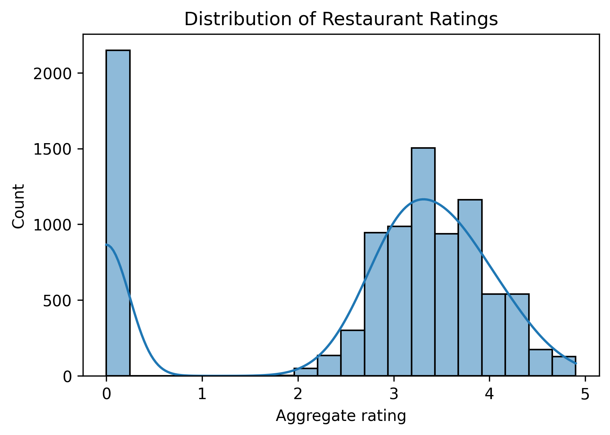
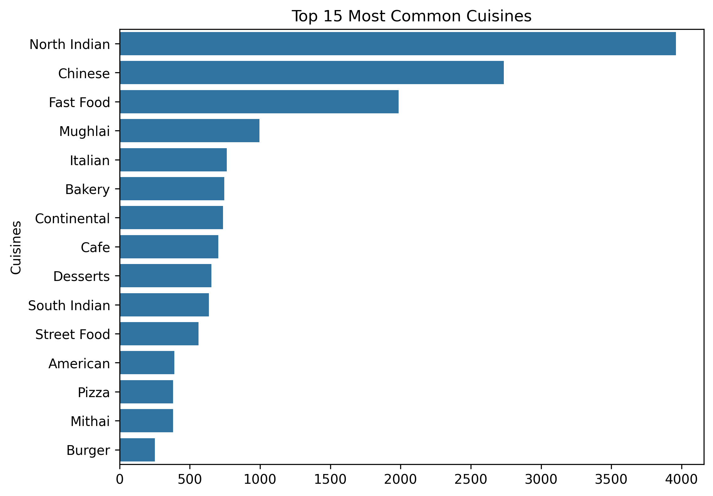
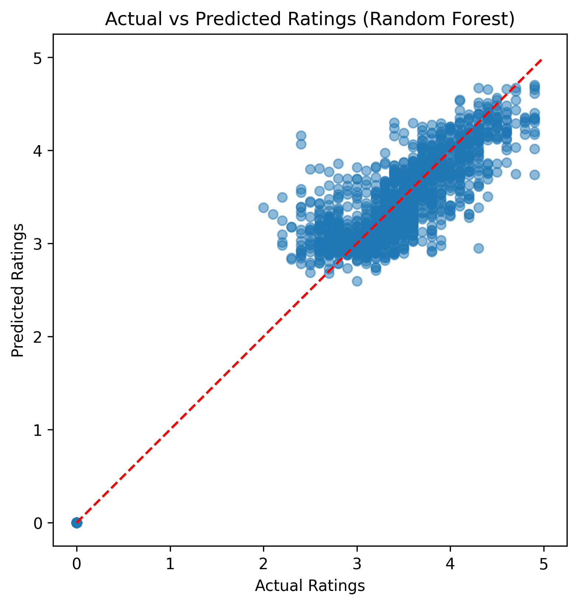
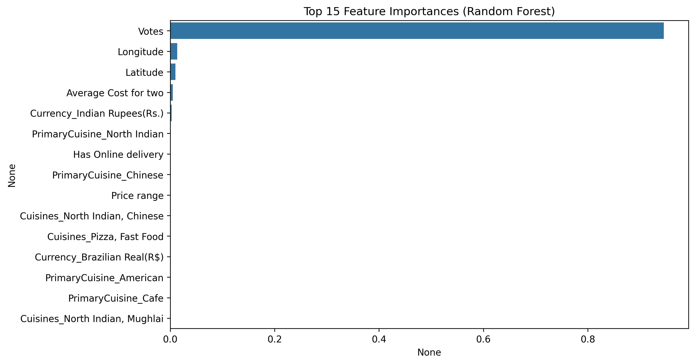

# 🍽️ Restaurant Ratings Prediction

## 📌 Project Overview
This project predicts **restaurant ratings** using machine learning based on features such as location, cuisines, cost, delivery options, and user votes.  

The dataset contains **9,551 restaurants** with details like cuisines, city, average cost, votes, and aggregate rating.  
The goal is to build and evaluate ML models to predict **Aggregate Rating** and understand which features most influence ratings.

---

## 📂 Repository Structure
restaurant-ratings/
├── data/
│ ├── raw/ # raw dataset (not uploaded to GitHub if large)
│ └── processed/ # cleaned dataset
├── notebooks/
│ ├── 01_eda.ipynb # exploratory analysis
│ ├── 02_preprocessing.ipynb # feature engineering
│ ├── 03_modeling.ipynb # model comparison
│ └── 04_evaluation.ipynb # evaluation & feature importance
├── models/
│ └── best_model.pkl # saved Random Forest model
├── outputs/
│ ├── predictions.csv # predictions file
│ └── figures/ # plots (EDA + evaluation)
├── src/
│ ├── data_utils.py # load/save data helpers
│ ├── features.py # feature engineering functions
│ ├── train.py # training pipeline
│ └── predict.py # inference pipeline
├── restaurant_ratings_final.ipynb # polished single notebook
├── requirements.txt
└── README.md

yaml

---

## 🛠️ Tech Stack
- **Python** (3.9+)  
- **Pandas, NumPy** → data handling  
- **Matplotlib, Seaborn** → visualization  
- **Scikit-learn** → ML models, preprocessing  
- **Joblib** → model persistence  
- **Jupyter Notebook** → experimentation  

---

## 🔎 Exploratory Data Analysis (EDA)
Key insights from the data:
- Most restaurants have ratings between **3.0 and 4.5**.  
- **Votes** (number of reviews) are highly skewed → few restaurants have very high votes.  
- **Top cuisines**: North Indian, Chinese, Pizza, South Indian.  
- Ratings distribution varies by city.  

---

## 🔧 Preprocessing
Steps taken:
- Filled missing values in `Cuisines`.  
- Extracted `PrimaryCuisine` from the first listed cuisine.  
- Converted Yes/No columns (`Has Table booking`, `Has Online delivery`) to 1/0.  
- Dropped irrelevant columns (`Restaurant ID`, `Address`, `Rating text`, etc.).  
- Standardized numeric features & one-hot encoded categorical features.  

---

## 🤖 Modeling
Models compared:
- **Linear Regression** → RMSE: ~1.23, R²: ~0.33  
- **Decision Tree** → RMSE: ~0.40, R²: ~0.93  
- **Random Forest** → RMSE: ~0.29, R²: ~0.96 ✅ (best)  

---

## 📊 Evaluation & Feature Importance
Final model: **Random Forest Regressor**

- **MSE:** 0.086  
- **RMSE:** 0.294  
- **R²:** 0.962  

## Top features:
1. **Votes** (most influential, ~94%)  
2. **Location (Longitude, Latitude)**  
3. **Average Cost for Two**  
4. **Cuisine Types** (North Indian, Chinese, American, etc.)  
5. **Service Features** (Online Delivery, Table Booking)  

---

## 🚀 How to Run Locally
1. Clone the repo:
   ```bash
   git clone https://github.com/<your-username>/restaurant-ratings.git
   cd restaurant-ratings
Create virtual environment:

bash
Copy code
python -m venv .venv
.venv\Scripts\activate   # Windows
# or
source .venv/bin/activate # Mac/Linux
Install requirements:

bash
Copy code
pip install -r requirements.txt
Train the model:

bash
Copy code
python -m src.train
Predict ratings on a dataset:

bash
Copy code
python -m src.predict data/raw/restaurant_ratings.csv
Open Jupyter notebooks for exploration:

bash
Copy code
jupyter notebook
📈 Results
Random Forest achieved 96% accuracy (R²) with low error (RMSE ~0.29).

The number of votes was the strongest predictor of ratings.

Cuisine type and delivery features added minor contributions.

## 📊 Example Plots  

### Distribution of Ratings  


### Top 15 Cuisines  


### Actual vs Predicted Ratings  


### Feature Importance  


---

## 🔮 Future Work  
- Test advanced models: XGBoost, LightGBM, CatBoost.  
- Hyperparameter tuning for Random Forest.  
- Deploy an interactive **Streamlit web app** for predictions.  
- Use larger datasets or live API data.


📜 License
This project is licensed under the MIT License.

yaml
Copy code

---

👉 This README is **portfolio-ready**.  
Next step: you should add **a few plots (PNG)** into `outputs/figures/` and reference them in the README with:  

```markdown
 
